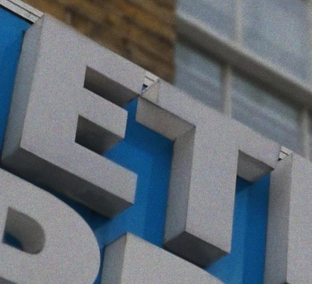
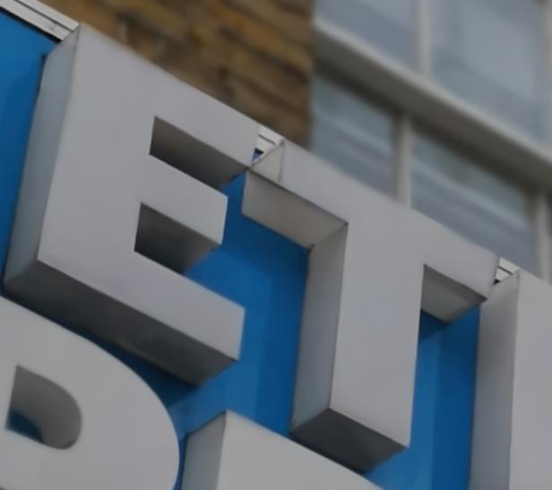

# Image Denoising
## Overview
The denoising method was developed based on EDSR [Paper](http://openaccess.thecvf.com/content_cvpr_2017_workshops/w12/papers/Lim_Enhanced_Deep_Residual_CVPR_2017_paper.pdf), an advanced super-resolution method. I found it could outperform other network architecture such as DnCNN, U-net, Densenet and RCAN in our case of image denoising.

## Task
The introduction of the challege is [here](http://eucompetition.huawei.com/uk/). Organizers provided paired GT images taken by P20 pro and noisy images (They added gaussian noise). We were asked to reduce the noise and recover the original images.

## Method
I briefly summarized the details of the method in slide [PDF](https://github.com/ZerojumpLine/Image-Denoising/blob/master/Huawei_Denoise_ZejuLi.pdf).

## Usage
As I do not know if I can provide the competition data and it is not public anymore, the code can not be run immediately. However, I think the code is easy to be adjust to another image recovery task. The model can be trainined using Denoisingtrain.py and be tested using Denoisingtest.py. Minor changes should be made for parsing paremeters about your own data in Denoisingtrain.py, Denoisingtest.py as well as data_generator.py. Basically, all the code which is needed to reproduce my results is uploaded to this repository.

## Performance
I used this method to beat other 40+ teams to win the 2018 UK AI competition.
 

## Acknowledgement
This code borrows heavily from [pytorch-RCAN-and-EDSR](https://github.com/yulunzhang/RCAN) and [DnCNN](https://github.com/cszn/DnCNN).
